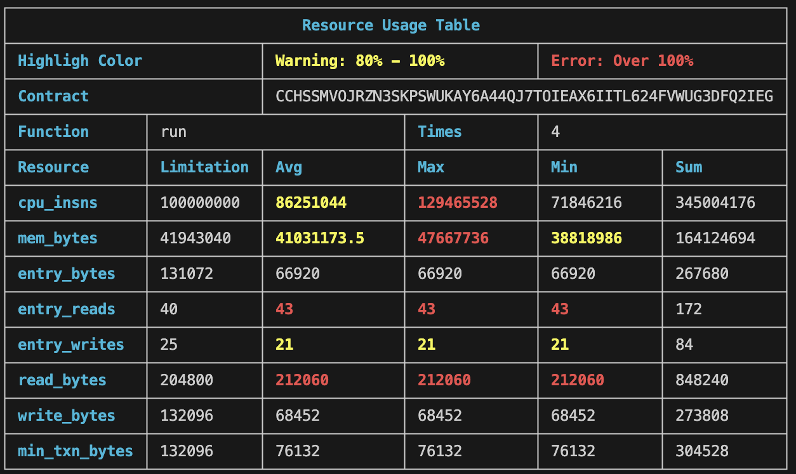

[](https://www.npmjs.com/package/@57block/stellar-resource-usage) 
[](https://github.com/57blocks/stellar-resource-usage-report/blob/main/CHANGELOG.md)

# Stellar Resource Usage

Welcome to Stellar Resource Usage! This tool is designed for Web3 developers working on the Stellar network, providing a convenient way to monitor and analyze the resources consumed by smart contracts during execution. This enables developers to optimize contract performance effectively.



# Features Overview

1. **Real-Time Resource Monitoring**: The tool monitors resource usage in real-time during smart contract execution, including `cpu_insns`, `mem_bytes` ect. for more information,see the [supported resource documentation](./docs/RESOURCE_LIMITS_DESC.md).


1. **Detailed Report Generation**: After contract execution, the tool generates a detailed report to help developers gain deeper insights into resource usage.


1. **Easy to use**: The amount of intrusion code is very small and it is easy to use.


1. **Open Source Contribution**: As an open-source project, we welcome community contributions, including bug fixes, feature enhancements, and improvement suggestions.


# Installation Guide
To install and run Stellar Resource Usage locally, follow these steps:


1. Install dependencies:

Using npm:
```sh
npm i @57block/stellar-resource-usage
```

Using pnpm:

```sh
pnpm add @57block/stellar-resource-usage
```

Using bun:

```sh
bun add @57block/stellar-resource-usage
```

# Usage Instructions

1. Make sure Docker Desktop is running on your system

2. Start the unlimited network simulator. Executing the code below will launch a [stellar/quickstart](https://github.com/stellar/quickstart) image. You can also customize your own image according to the *quickstart* if you want.

 _Note: Using npx requires you to install npm globally in advance, more info please refer to [npx](https://docs.npmjs.com/cli/v10/commands/npx)_

```sh
npx dockerDev [--port=your port] # The default port is 8000 
```

3. Make sure you have seen a steady stream of *stellar-core: Synced!* logs in `step 2`. Deploy your contract once your local network is running. If you don’t know how to deploy a contract, you can check the [Stellar build doc](https://developers.stellar.org/docs/build/smart-contracts/getting-started) or the [deploy.example.ts](./deploy.example.ts) we provide for reference.

4. Using `@57block/stellar-resource-usage` in your code

**Scenario 1**

When you generate a typescript module using the `stellar contract bindings typescript` command, and use the `Client` in this module to call and execute the contract functions.
<!-- Please refer to [the link](https://developers.stellar.org/docs/tools/developer-tools/cli/stellar-cli#stellar-contract-bindings-typescript) and/or [deploy.example.ts](./deploy.example.ts) if you want to learn more about **bindings**. -->

```ts
import { Keypair } from "@stellar/stellar-sdk";
import { basicNodeSigner } from "@stellar/stellar-sdk/contract";

import { Client, networks } from "yourPath/to/module";

const callContract = async () => {
  try {
    const keypair = Keypair.fromSecret(Bun.env.SECRET!);
    const pubkey = keypair.publicKey();

    const { signTransaction } = basicNodeSigner(
      keypair,
      networks.standalone.networkPassphrase
    );

    const _contract = new Client({
      contractId: networks.standalone.contractId,
      networkPassphrase: networks.standalone.networkPassphrase,
      rpcUrl: "http://localhost:8000/soroban/rpc",
      publicKey: pubkey, // process.env.SOROBAN_PUBLIC_KEY,
      allowHttp: true,
      signTransaction,
    });
    const res = await _contract.run({
      cpu: 700,
      mem: 180,
      set: 20,
      get: 40,
      events: 1,
      _txn: Buffer.alloc(71_680),
    });

    await res.signAndSend();
  } catch (error) {
    console.error(error);
  }
};

callContract();

```

While using `@57block/stellar-resource-usage`:

```ts
import { Keypair } from "@stellar/stellar-sdk";
import { basicNodeSigner } from "@stellar/stellar-sdk/contract";
// Add ResourceUsageClient
+ import { ResourceUsageClient } from "@57block/stellar-resource-usage";
import { Client, networks } from "./package/typescriptBinding/src";

const callContract = async () => {
  try {
    const keypair = Keypair.fromSecret(Bun.env.SECRET!);
    const pubkey = keypair.publicKey();

    const { signTransaction } = basicNodeSigner(
      keypair,
      networks.standalone.networkPassphrase
    );

-    const _contract = new Client({
+    const _contract = await ResourceUsageClient<Client>(Client, {
      contractId: networks.standalone.contractId,
      networkPassphrase: networks.standalone.networkPassphrase,
      rpcUrl: "http://localhost:8000/soroban/rpc",
      publicKey: pubkey, // process.env.SOROBAN_PUBLIC_KEY,
      allowHttp: true,
      signTransaction,
    });
    const res = await _contract.run({
      cpu: 700,
      mem: 180,
      set: 20,
      get: 40,
      events: 1,
      _txn: Buffer.alloc(71_680),
    });

    await res.signAndSend();

+   _contract.printTable();
  } catch (error) {
    console.error(error);
  }
};

callContract();
```

**Scenario 2**

Using `ResourceServer`.

Note: We'll refactor the function to avoid need user to pass secret key.

```ts
import { Keypair, Networks, nativeToScVal } from '@stellar/stellar-sdk';
import { ResourceServer } from '@57block/stellar-resource-usage';


const rpcUrl = 'http://localhost:9000/rpc';
const contractId = Bun.env.CONTRACT_ID;
const networkPassphrase = Networks.STANDALONE;

const args = [
  nativeToScVal(150, { type: 'u32' }),
  ...
]

const resourceServer = ResourceServer({
  networkPassphrase,
  secretKey, // Your secret key.
  rpcUrl,
});

resourceServer.calcResourceForTx([
  {
    contract: contractId,
    function: 'func',
    args,
  }
]);
```
5. Execute the file

For typescript files, we recommend using [bun](https://bun.sh/) to run directly, which makes the command very simple, just execute `bun run filepath`. Then you will see the reporter in the terminal.

# Support
If you need assistance or have any questions, you can submit issues on GitHub Issues, and we'll respond as soon as possible.

# License
This project is open-source under the MIT License.

Enhance your smart contract efficiency and speed with Stellar Resource Usage! Thank you for using this tool, and we look forward to your feedback and contributions.
