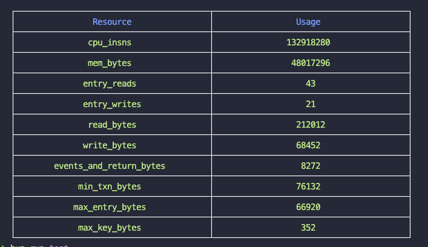

# stellar-resource-usage

[](https://www.npmjs.com/package/stellar-resource-usage) 

# Summary

---

As a resource utilization tool based on Node.js, it allows developers to generate resources using the resource utilization tool for reference when writing tests.

# Example Report


# Installation

---

**npm**

```sh
npm i stellar-resource-usage
```

**pnpm**

```sh
pnpm add stellar-resource-usage
```

**bun**

```sh
bun add stellar-resource-usage
```

# Usage

---

```ts
import calcResource from "stellar-resource-usage";

....
 const stats = {
      cpu_insns: 132918280,
      mem_bytes: 48017296,
      entry_reads: 43,
      entry_writes: 21,
      read_bytes: 212012,
      write_bytes: 68452,
      events_and_return_bytes: 8272,
      min_txn_bytes: 76132,
      max_entry_bytes: 66920,
      max_key_bytes: 352,
    };
  
  calcResource(stats)
```


